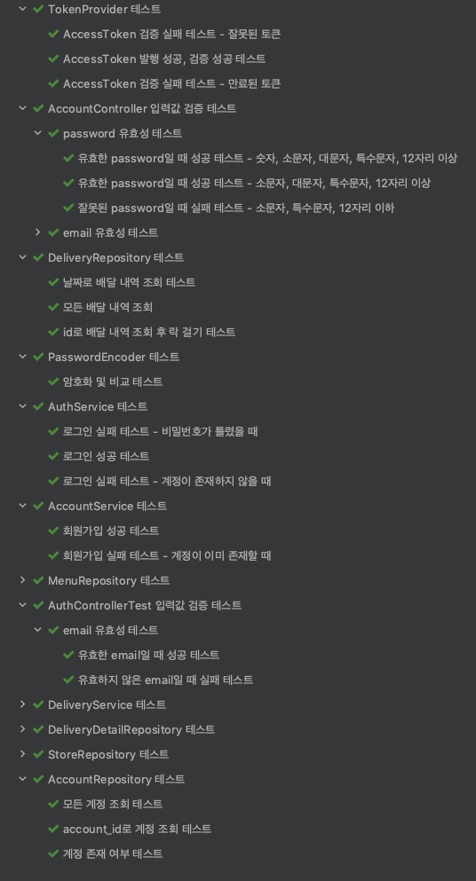

# 배달 서비스

## 기술 스택
- Java 8
- Spring Boot, Spring MVC
- Spring Security, JWT
- Spring Data JPA
- H2
- JUnit 5
- Swagger 2

## 데이터베이스 설계

ER Diagram은 다음과 같습니다.

- 인메모리 데이터베이스(`H2`)를 사용합니다.
- 데이터베이스 스키마는 [이 곳](src/main/resources/sql/schema.sql)에서 확인할 수 있습니다.
- 더미 데이터는 [이 곳](src/main/resources/sql/data.sql)에서 확인할 수 있습니다.

## 기능 구현
- [x] 회원 가입
- [x] 로그인
- [x] 배달 조회
- [x] 배달 목적지 수정

## TDD
다양한 테스트 코드는 이 곳에서 [이 곳](src/test)에서 확인할 수 있습니다. 

테스트 코드는 IDE에서 실행하거나 프로젝트 루트 경로에서 `./gradlew clean test` 명령어로 실행할 수 있습니다.

## Documentation
`Swagger 2`를 사용하여 문서화를 했습니다. 어플리케이션 실행 후 `http://<HOST>:<PORT>/swagger-ui.html`에서 확인할 수 있습니다.

